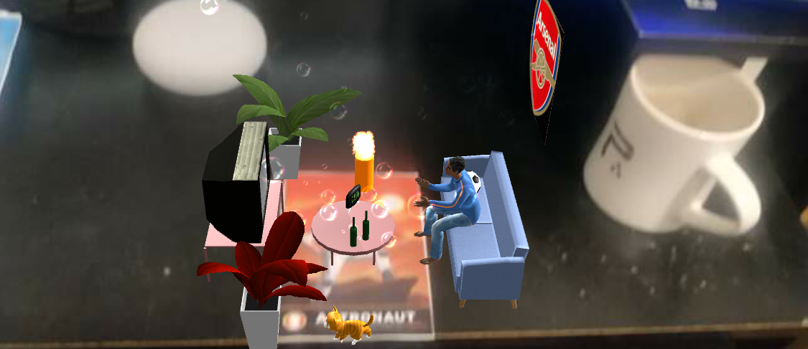
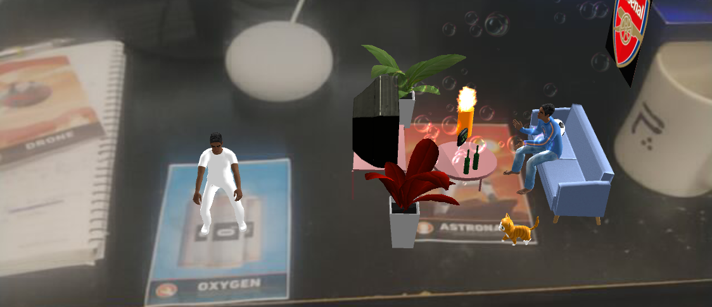
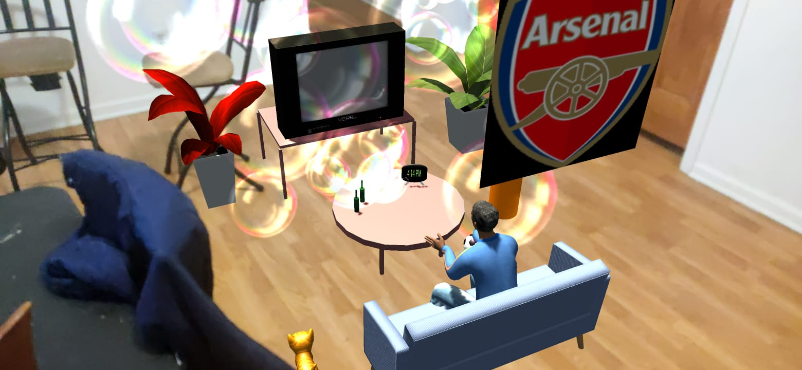

# Augmented Humanoid

This is a course project (Project 2) - In the Land of Make Believe, for CS 428 - Virtual, Augmented & Mixed Reality at UIC under Professor Andrew Johnson ([course link](https://www.evl.uic.edu/aej/428/)). 

***

### Requirements

* [Unity 2019.4.1f1](https://unity3d.com/get-unity/download)
* [Vuforia 9](https://developer.vuforia.com/downloads/sdk)
* Webcam

### How to run

1. Clone the project and open it in Unity
2. For the table top scene using image markers -
    * Open the Scenes folder in Assets and load the ```TableTop``` scene
    * Obtain copies of the following image targets from the Vuforia Mars database - 
      * Astronaut
      * Drone
      * Fissure
      * Oxygen
    * Connect your webcam as the camera source for Vuforia engine
    * Click Play in the Unity editor
3. For the lifesize scene - 
    * Open the Scenes folder in Assets and load either the ```Lifesize``` scene
    * Deploy the scene to a mobile device such as Android or iOS by going to File -> Build Settings
    * Once the app runs on the phone, click on a location to initialize the scene at the that location
    
### Description

This is an augmented reality application that displays a scene involving a humanoid version of myself. On weekends, I like to laze back in my couch and watch my favourite team, Arsenal FC, play in the English Premier League. The scene is a depiction of such a weekend -
* On the **Astronaut** image marker is the main playset, that depicts my "laid-back persona" on a couch watching the game on the TV. There are also some cool animations, like a burning candle, a bubble machine, and my imaginary pet cat, Javier
* On the **Fissure** marker, there is a virtual button that the user can play with
* The **Drone** marker contains a model of the table top that is used to simulate collisions
* The **Oxygen** marker displays my "workout persona" (wish this persona existed in real life) doing squats

### Features

* Moving your hand over the virtual button on the Fissure marker makes the laid-back persona get up from the couch and fist-pump while saying "Let's go!". This is a toned down representation of my behaviour when Pierre-Emerick Aubameyang, the no. 14 in Arsenal, scores a goal
* The Drone marker is positioned in such a way that the bottom edge of the image lines up with the bottom edge of the table top. So, the user needs to position the image marker on the edge of a real table surface to get the correct effect
* On clicking the left mouse button, red balls are generated on top of the Astronaut marker that fall over the objects in the scene. If the Drone marker is positioned appropriately, the balls bounce of the table top and roll away
* The workout persona can be brought out using the Oxygen image marker, and depicts me doing squats. When the Oxygen marker is moved really close to the Astronaut marker, the workout persona stops his squats to chide the laid-back persona, saying "Get off the couch and workout". Laid-back me sometimes requires harsh motivations
* The life-size version of the playset on the Astronaut marker can be found in the scene labelled ```Lifesize``` in the Assets folder, and can be deployed to an Android or iOS device by going to File -> Build Settings and building it on your device. On the device, point your phone on the ground and click to initialize the scene

### Screenshots



__Laid-back persona__



__Workout persona__

 

__Lifesize playset__

### Credits

1. [Modern Minimalist Sofa](https://assetstore.unity.com/packages/3d/props/furniture/modern-minimalist-sofa-136398)
2. [Old Television PBR FREE](https://assetstore.unity.com/packages/3d/props/electronics/old-television-pbr-free-101886#content)
3. [Low Polygon Soccer Ball](https://assetstore.unity.com/packages/3d/low-polygon-soccer-ball-84382)
4. [Plants](https://assetstore.unity.com/packages/3d/vegetation/plants/plants-150261#content)
5. [Arsenal.png](https://en.wikipedia.org/wiki/Arsenal_F.C.) - Texture
6. [Sports Crowd Sound](http://soundbible.com/1881-Sports-Crowd.html) - by GoGo
7. [Free Chibi Cat](https://assetstore.unity.com/packages/3d/characters/animals/mammals/free-chibi-cat-165490#content)
8. [Flame texture](https://www.pexels.com/photo/fire-wallpaper-207353/)
9. [Jiggly Bubble](https://assetstore.unity.com/packages/vfx/particles/environment/jiggly-bubble-free-61236#content)
